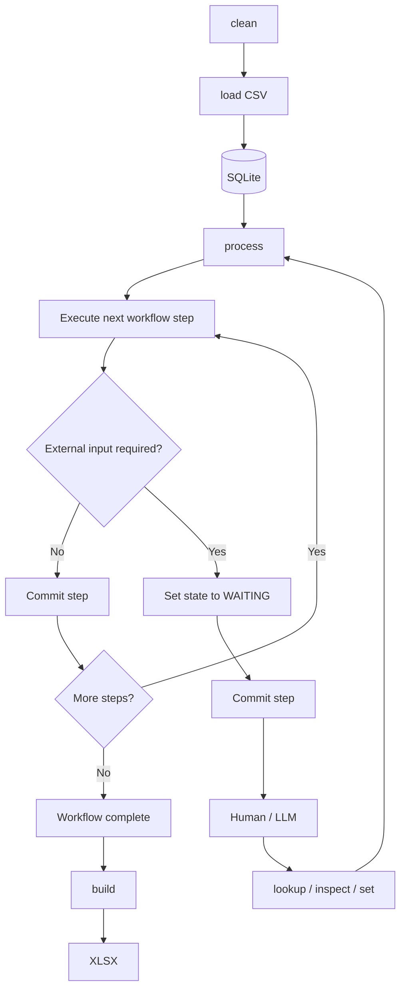

# Processing Architecture

The application processes **one CSV run at a time** using SQLite as the persistent working database.

The workflow is stateful and resumable. Each business-logic step runs transactionally and commits before the next step begins.

## Overall Flow



## CLI

```text
clean
load
process
process --step
process --from-step <step>
status
lookup
inspect
set
dump
build
```

- `clean` — Reset the database for a new CSV run.
- `load` — Import the CSV into the incoming tables.
- `process` — Execute workflow steps continuously until the workflow completes or cannot proceed.
- `process --step` — Execute exactly one workflow step, commit it, then stop.
- `process --from-step <step>` — Begin/reprocess execution from a specified step.
- `status` — Show the current overall workflow state and outstanding work.
- `lookup` — Retrieve information needed for business decisions.
- `inspect` — Examine current data, including processing tables.
- `set` — Supply or modify externally determined values.
- `dump` — Debug/inspect SQLite state.
- `build` — Generate the final XLSX from the completed database state.

`process` operates on the **whole database**. Individual processing IDs are database identities rather than normal CLI targets.

## Database Structure

SQLite contains three conceptual types of tables.

### Incoming Tables

These contain data imported from the CSV.

```text
incoming_*
```

Incoming rows represent work that has not yet been consumed by the workflow.

### Processing Tables

Processing tables are **created when a step needs them**.

A step may:

1. Create its processing table.
2. Extract a subset of rows from an incoming table.
3. Write those rows into the processing table.
4. Remove the consumed rows from the incoming table.
5. Commit the entire operation.

For example:

```text
incoming_orders
      ↓
Step: prepare_orders
      ↓
processing_orders
```

A later step can then work entirely against `processing_orders`.

Processing tables are therefore **durable working areas**, not a fixed set of tables and not necessarily one table per step.

A step owns the creation and initialization of the processing tables it requires. If it needs an empty table, it is responsible for clearing or recreating it.

### Output Tables

These contain the final structured data used by `build`.

```text
customers
orders
...
```

## Run State

A small `state` table stores the state of the **current CSV run**.

For example:

```text
status
current_step
source_file
updated_at
```

There is one current run at a time.

The distinction is:

```text
state
  → overall workflow state

incoming_*
  → imported data not yet consumed

processing_*
  → working data being transformed or reviewed

output tables
  → final business data
```

## Workflow Steps

Steps contain the actual business logic.

A step may:

- read incoming data
- create or modify processing tables
- move rows between tables
- create or modify output data
- determine that external information is required
- advance the workflow

A step is a **transaction boundary**.

Conceptually:

```text
BEGIN

read SQLite state
apply business logic
modify business data
create/move processing data
update workflow state

COMMIT
```

The business changes and workflow-state update are committed together.

If the step fails, the transaction rolls back.

## External Input

A step may reach a point where it cannot proceed without human or LLM input.

It then records the required state and commits:

```text
PROCESSING
    ↓
WAITING
```

The human or LLM can inspect the relevant processing data and use commands such as:

```text
lookup
inspect
set
```

to supply the missing information.

Running `process` again resumes the workflow from its persisted state.

`WAITING` is a normal workflow state, not an error.

## Step-by-Step Execution

`process --step` provides a deliberate pause after every committed step.

```text
process --step
    ↓
Step A
    ↓ COMMIT
STOP

process --step
    ↓
Step B
    ↓ COMMIT
STOP

process --step
    ↓
Step C
    ↓ COMMIT
STOP
```

This is useful for development, debugging, and LLM-assisted workflows because the database can be inspected between steps.

Normal execution remains:

```text
process
```

which continues automatically until the workflow completes or reaches a state requiring external input.

## Reprocessing

`process --from-step <step>` allows the workflow to be deliberately re-entered at a specified step.

This is primarily useful for recovery, development, or rerunning business logic after changing a step.

It does not imply that the workflow normally operates on individual processing records.

## LLM / Human Role

The human or LLM acts as an **operator**, while Python remains authoritative over workflow execution and database mutations.

The operator can:

- inspect the current state
- inspect processing data
- perform lookups
- determine externally required values
- supply those values
- run processing steps

The LLM does not directly modify SQLite or issue arbitrary SQL. It interacts through the application's defined operations.

## Run Lifecycle

A complete CSV run follows this lifecycle:

```text
clean
  ↓
load
  ↓
process
  ↓
build
  ↓
XLSX complete
  ↓
clean
  ↓
next CSV
```

`clean` establishes the starting invariant for a new run: previous incoming, processing, and output data are removed/reset so processing begins from a known empty state.

## Core Principle

**SQLite is the source of truth for the current CSV run.**

At any point, the database should describe:

- the current workflow step
- the data already consumed from the CSV
- the data currently being worked on
- the completed business data
- any information required from a human or LLM
- what the next step is
