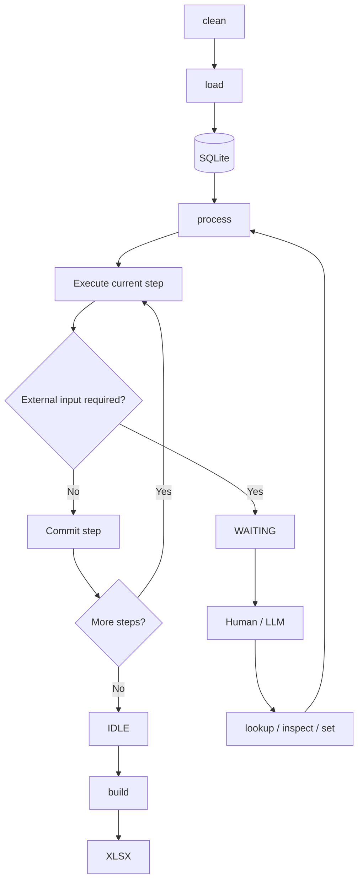

# Processing Architecture

The application processes **one CSV at a time** through a transactional, stateful workflow backed by SQLite.

## Workflow



## CLI

| Command | Purpose |
|---|---|
| `clean` | Clear the database for a new CSV run. |
| `load` | Import the CSV into `incoming`. |
| `process` | Execute steps continuously until complete or waiting. |
| `process --step` | Execute one step, commit, then stop. |
| `process --from-step <step>` | Start processing from a specified step. |
| `status` | Show the current process state and step. |
| `lookup` | Retrieve information needed by a step. |
| `inspect` | Inspect current database and processing data. |
| `set` | Supply or modify externally determined values. |
| `dump` | Debug/inspect SQLite contents. |
| `build` | Generate the final XLSX. |

`process` operates on the **whole database**. Processing IDs are database identities, not normal CLI targets.

## Process State

A single-row `state` table tracks the state of the **processing workflow itself**.

```text
state
-----
status
current_step
```

Valid process states:

| State | Meaning |
|---|---|
| `IDLE` | No processing workflow is currently active. |
| `PROCESSING` | The workflow is advancing through its steps. |
| `WAITING` | Processing is paused at `current_step` awaiting external input. |

`current_step` identifies the workflow position while the process is `PROCESSING` or `WAITING`.

`load`, `clean`, and `build` are actions, not process states.

## Database

SQLite contains three conceptual types of data:

- **`incoming`** — the data imported from the CSV.
- **`processing_*`** — durable working tables created by steps when useful.
- **Output tables** — final business data consumed by `build`.

A step may move a subset of rows from `incoming` into a processing table and remove those rows from `incoming` in the same transaction.

Processing tables are created and initialized by the first step that needs them. A step is responsible for clearing or recreating its processing table when it requires a fresh working set.

## Steps

Steps contain the business logic and are the transaction boundaries.

A step may:

- read `incoming` or processing data
- create or modify processing tables
- move rows between tables
- create or modify output data
- require external human/LLM input
- advance the workflow

Conceptually:

```text
BEGIN
  perform step
  update process state
COMMIT
```

The business changes and process-state update commit together.

If a step fails, the transaction rolls back and the process remains at its previous committed state.

## External Input

A step may determine that it cannot continue without human or LLM input.

It commits with:

```text
status = WAITING
current_step = <step>
```

The operator can then inspect the relevant processing data, perform lookups, and supply required values.

Running `process` again resumes the workflow.

`WAITING` is a normal process state, not an error.

## Step-by-Step Execution

`process --step` executes exactly one step, commits it, and exits.

```text
process --step
    ↓
Step A
    ↓ COMMIT
STOP

process --step
    ↓
Step B
    ↓ COMMIT
STOP
```

This allows the database to be inspected between steps and is useful for development, debugging, and LLM-assisted processing.

## Reprocessing

`process --from-step <step>` allows processing to be deliberately re-entered at a specified step.

This is primarily for recovery, development, or rerunning business logic after a step has changed.

## LLM / Human Role

The human or LLM acts as an **operator**, while Python remains authoritative over workflow execution, business rules, transactions, and database mutations.

The operator can inspect data, perform lookups, and supply required values through the defined CLI operations.

## Lifecycle

```text
clean → load → process → build → clean
```

`clean` establishes a fresh database for the next CSV run.

## Core Principle

**SQLite is the source of truth for the current CSV run, and each step advances the processing state transactionally.**
