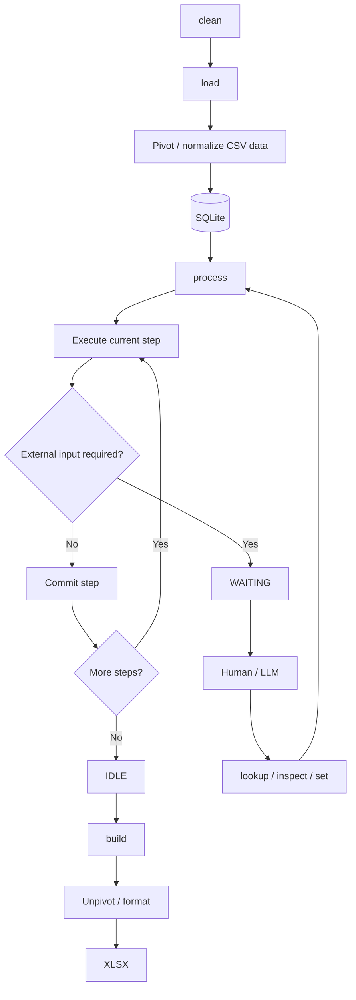

# Processing Architecture

The application processes **one CSV at a time** through a transactional, stateful workflow backed by SQLite.



## CLI

| Command                      | Purpose                                                                          |
| ---------------------------- | -------------------------------------------------------------------------------- |
| `clean`                      | Clear the database for a new CSV run.                                            |
| `load`                       | Import the CSV, pivoting redundant source rows into the database representation. |
| `process`                    | Execute steps continuously until complete or waiting.                            |
| `process --step`             | Execute one step, commit, then stop.                                             |
| `process --from-step <step>` | Start processing from a specified step.                                          |
| `status`                     | Show the current process state and step.                                         |
| `lookup`                     | Retrieve information needed by a step.                                           |
| `inspect`                    | Inspect current database and processing data.                                    |
| `set`                        | Supply or modify externally determined values.                                   |
| `dump`                       | Debug/inspect SQLite contents.                                                   |
| `build`                      | Generate the final XLSX, unpivoting data as required by the output format.       |

`process` operates on the **whole database**. Processing IDs are database identities, not normal CLI targets.

## Process State

A single-row `state` table tracks the state of the **processing workflow itself**.

```text
state
-----
status
current_step
```

Valid states:

| State        | Meaning                                                         |
| ------------ | --------------------------------------------------------------- |
| `IDLE`       | No processing workflow is currently active.                     |
| `PROCESSING` | The workflow is advancing through its steps.                    |
| `WAITING`    | Processing is paused at `current_step` awaiting external input. |

`current_step` identifies the workflow position while the process is `PROCESSING` or `WAITING`.

`load`, `clean`, and `build` are actions, not process states.

## Database

SQLite is the **working representation and source of truth for the current CSV run**.

```text
state
incoming
processing_*
output_*
```

* **`incoming`** — the pivoted/normalized representation of the CSV data that has not yet been consumed by processing.
* **`processing_*`** — durable working tables created by steps when useful.
* **Output tables** — final business data consumed by `build`.

There is only one incoming table.

A step may move a subset of rows from `incoming` into a processing table and remove those rows from `incoming` in the same transaction.

Processing tables are created by the first step that needs them. A step is responsible for clearing or initializing its processing table when it requires a fresh working set.

## Steps

Steps contain the **business logic** of the application.

Steps are Python functions registered with a decorator:

```python
@step(10)
def extract_customers(db):
    ...

@step(20)
def match_customers(db):
    ...

@step(30)
def resolve_customers(db):
    ...
```

The decorator registers the step and its execution order. Step numbers should be sparse so new steps can be inserted without renumbering existing steps.

Steps operate directly against the database and are **set-oriented rather than row-oriented**.

A step may:

* query `incoming`
* create or modify processing tables
* move sets of rows between tables
* create or modify output data
* perform complex business logic
* require external human/LLM input

The database, rather than Python objects, is the primary working medium.

## Transactions

Each step is a transaction boundary.

Conceptually:

```text
BEGIN
    perform step
    update process state
COMMIT
```

The step's business changes and workflow-state update commit together.

If a step fails:

```text
BEGIN
    ...
    ERROR
ROLLBACK
```

The database returns to the state before the step began, allowing the step to be retried.

## External Input

A step may determine that it cannot continue without human or LLM input.

It commits with:

```text
status = WAITING
current_step = <step>
```

The operator can then inspect the relevant processing data, perform lookups, and supply required values.

Running `process` again resumes the workflow.

`WAITING` is a normal process state, not an error.

## Step-by-Step Execution

`process --step` executes exactly one step, commits it, and exits.

```text
process --step
    ↓
Step A
    ↓ COMMIT
STOP

process --step
    ↓
Step B
    ↓ COMMIT
STOP
```

This allows the database to be inspected or modified between steps and is useful for development, debugging, and LLM-assisted processing.

## Reprocessing

`process --from-step <step>` allows processing to be deliberately re-entered at a specified step.

This is primarily for recovery, development, or rerunning changed business logic.

## Step Discovery and Ordering

Steps are discovered through their decorators.

The step registry provides:

```text
step name
execution order
callable
```

Execution order is determined by the decorator's numeric order rather than by filename or alphabetical order.

## I/O Boundaries

Pivoting and unpivoting are **format/representation transformations**, not processing steps.

### Load

The CSV may contain many redundant rows. `load` pivots this data into the more compact database representation before inserting it into `incoming`.

```text
CSV
 ↓
pivot / normalize
 ↓
incoming
```

This prevents the business-processing workflow and LLM from unnecessarily working with tens of thousands of redundant source rows.

### Build

The database uses the canonical business representation. `build` transforms that representation into the row structure required by the final XLSX.

```text
output tables
 ↓
unpivot / format
 ↓
XLSX
```

Thus:

**`load` and `build` adapt external representations; `process` performs business logic.**

## LLM / Human Role

The human or LLM acts as an **operator**, while Python remains authoritative over workflow execution, business rules, transactions, and database mutations.

The operator can:

* inspect processing data
* perform lookups
* supply externally determined values
* resume processing

The LLM does not directly control arbitrary SQL or the workflow state.

## Lifecycle

```text
clean → load → process → build → clean
```

`clean` establishes a fresh database for the next CSV run.

## Core Principle

**SQLite is the source of truth for the current CSV run. Processing steps advance that state through transactional, set-oriented business operations, with durable processing tables available when a step needs a working dataset.**
